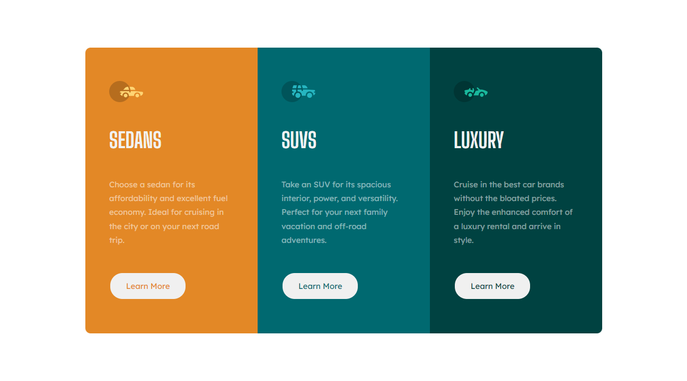

# Frontend Mentor - 3 Column Preview Card Component Solution

This is a solution to the [3 Column Preview Card Component challenge on Frontend Mentor](https://www.frontendmentor.io/challenges/3column-preview-card-component-pH92eAR2-). Frontend Mentor challenges help you improve your coding skills by building realistic projects.

## Table of contents

- [Overview](#overview)
  - [Screenshot](#screenshot)
  - [Links](#links)
- [My process](#my-process)
  - [Built with](#built-with)
  - [What I learned](#what-i-learned)
- [Author](#author)

## Overview

### Screenshot

### Links

- Solution URL: [Github](https://github.com/EcePJD/frontendMentor_3columnPreviewCardComponent)
- Live Site URL: [Github.io](https://ecepjd.github.io/frontendMentor_3columnPreviewCardComponent/)

## My process
FIrst, I properly organized the index.html contents to fit my envisioned html organization that is advantageous to the CSS approach I used after. As usual, I used flexBox CSS to easily organized the elements.

### Built with
- Semantic HTML5 markup
- CSS custom properties
- Mobile-first workflow

### What I learned
Refresher for basic HTML and CSS.

## Author

- Github - [@EcePJD](https://github.com/EcePJD)
- Frontend Mentor - [@EcePJD](https://www.frontendmentor.io/profile/EcePJD)
- Facebook - [@ECEPJDeLeon](https://www.facebook.com/ECEPJDeLeon)